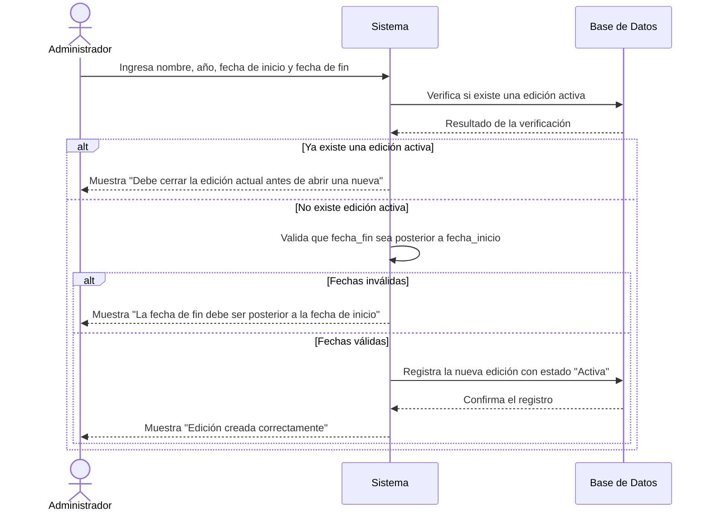
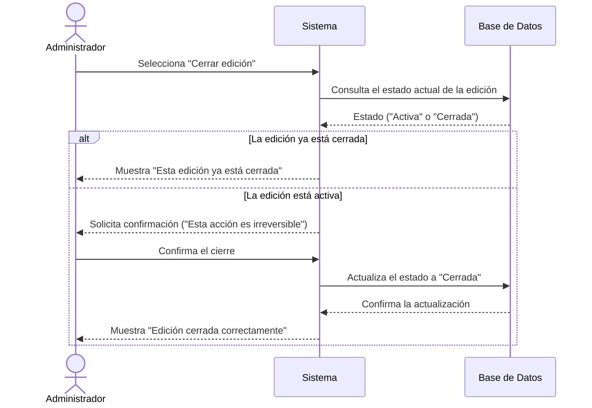
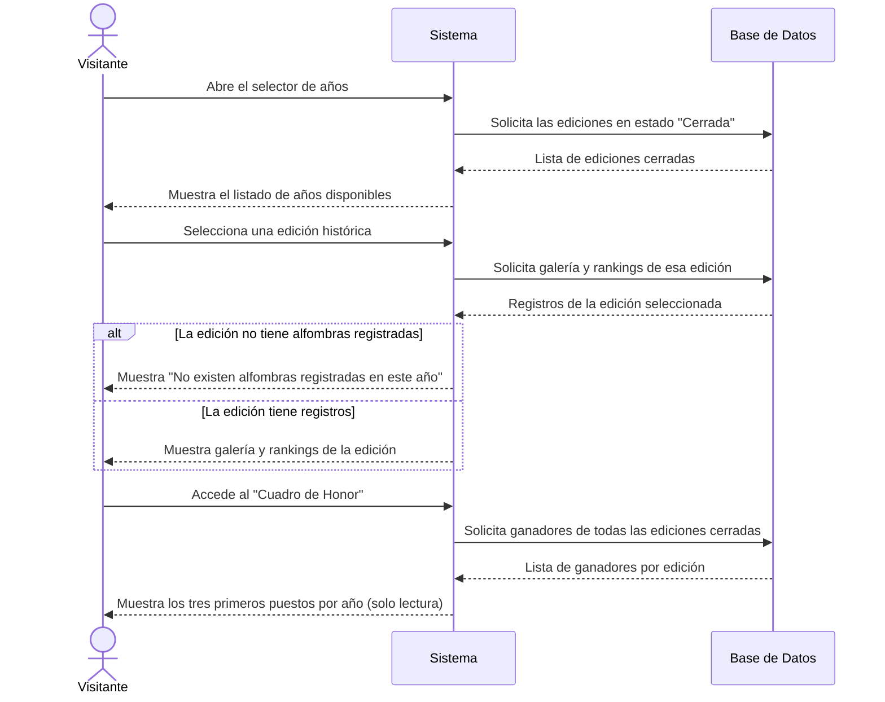

# Diagramas de Secuencia — Ediciones

Los diagramas muestran la interacción desde la perspectiva de uso: **Actor → Sistema → Base de Datos**, sin detallar la lógica interna de desarrollo (capas, clases o servicios del backend).

## 1. Crear nueva edición (EDI-02)

## 2. Cerrar la edición en curso (EDI-03)

## 3. Consultar historial de ediciones y cuadro de honor (EDI-04 / EDI-05)

