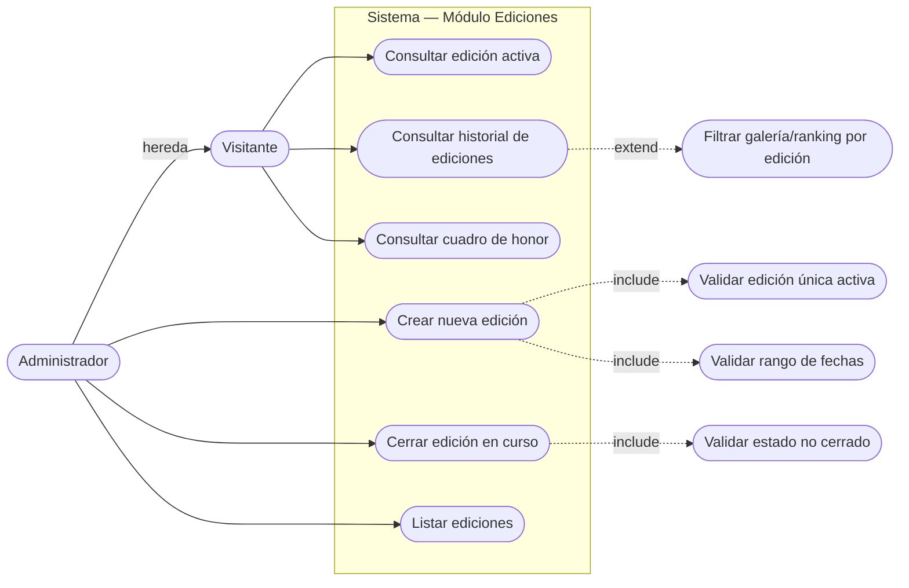

# Diagrama de Casos de Uso — Ediciones

## Descripción de los casos de uso

| Caso de uso | Actor | Precondición | Descripción breve |
|:--|:--|:--|:--|
| Crear nueva edición | Administrador | No debe existir ninguna edición en estado "Activa" | Registra nombre, año, fecha de inicio y fecha de fin; el sistema asigna el estado "Activa" automáticamente. |
| Cerrar edición en curso | Administrador | Debe existir una edición en estado "Activa" | Cambia el estado de la edición vigente a "Cerrada" de forma irreversible. |
| Listar ediciones | Administrador | Sesión de administrador activa | Lista paginada de todas las ediciones (activas y cerradas) con filtro por nombre. |
| Consultar edición activa | Visitante / Sistema | — | Expone la edición vigente como contexto por defecto para Alfombras y Dinámica. |
| Consultar historial de ediciones | Visitante | Deben existir ediciones en estado "Cerrada" | Lista pública de ediciones cerradas mediante un selector de años. |
| Consultar cuadro de honor | Visitante | Deben existir ediciones cerradas con ganadores | Muestra los tres primeros puestos de Alfombras y Kahoot por edición, de solo lectura. |

## Notas sobre permisos

- **Visitante** accede a las operaciones de solo lectura (UC4, UC5, UC6).
- **Administrador** hereda todos los casos de uso del Visitante y además puede ejecutar las operaciones de escritura (UC1, UC2, UC3).
- La flecha `hereda` entre actores representa la generalización UML: el Administrador *es un* Visitante con permisos adicionales.
