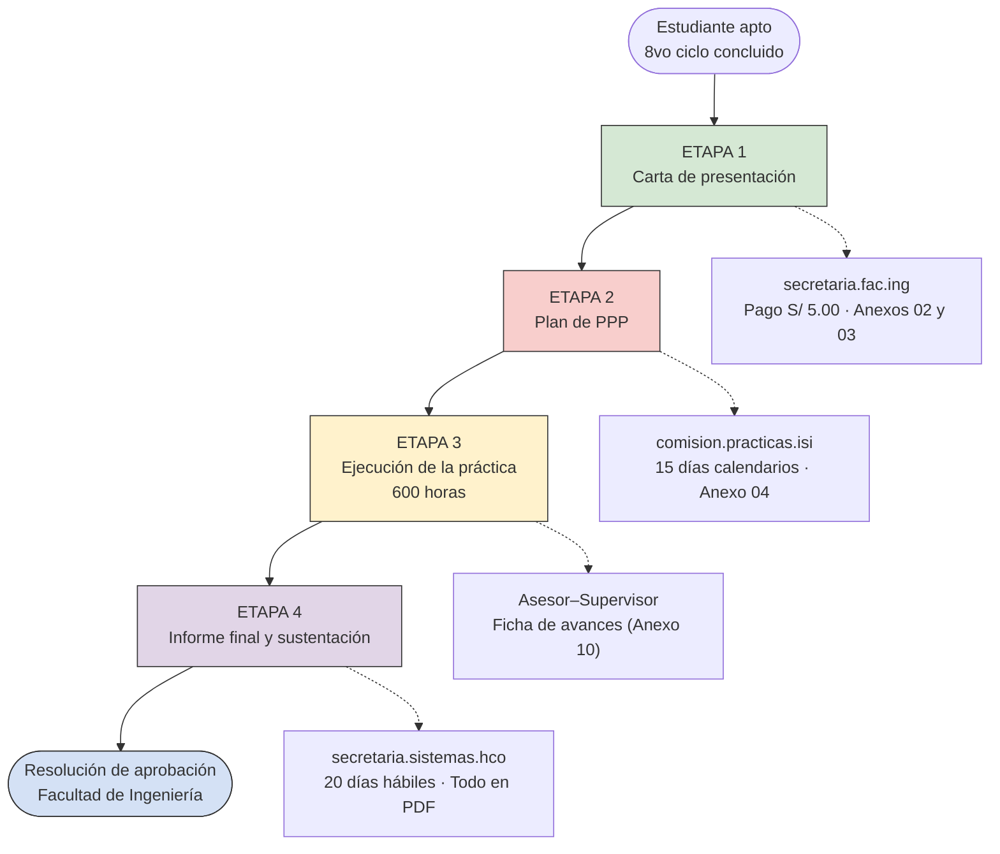
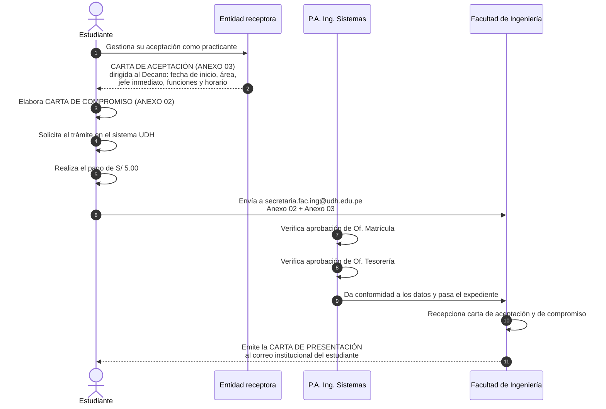
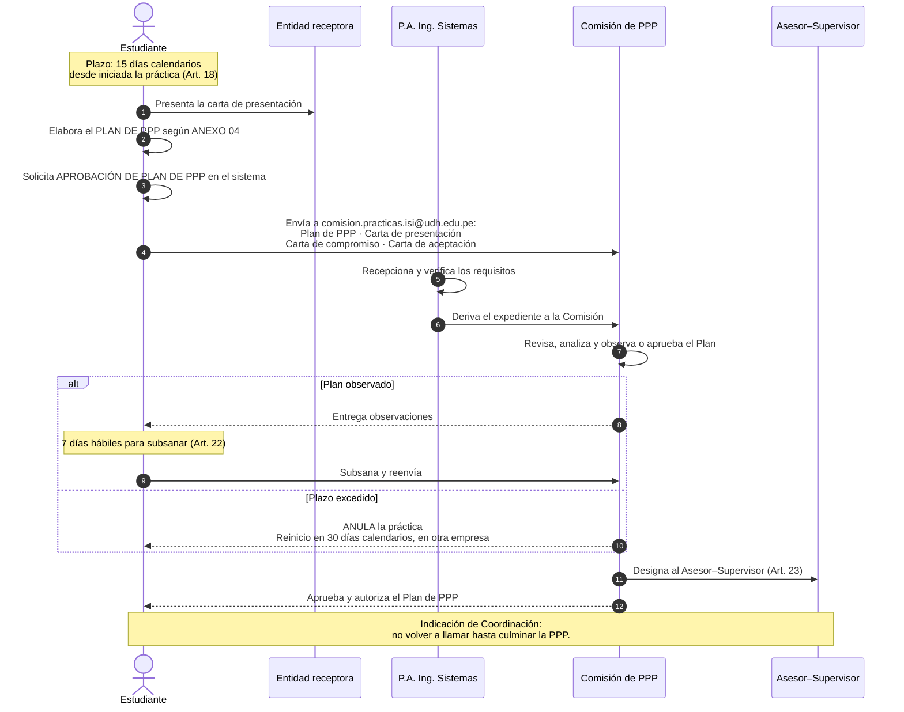
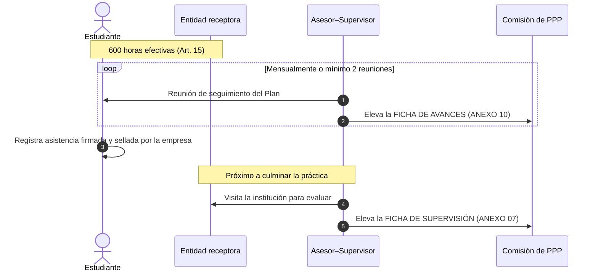
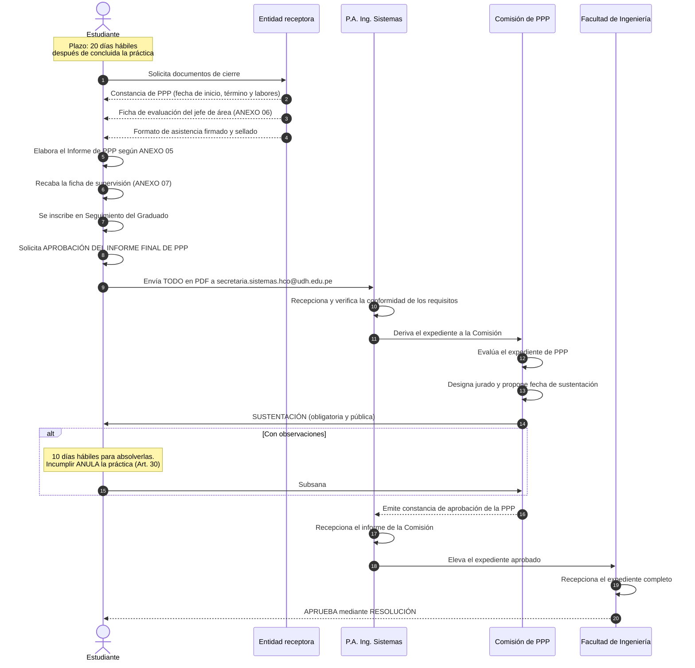
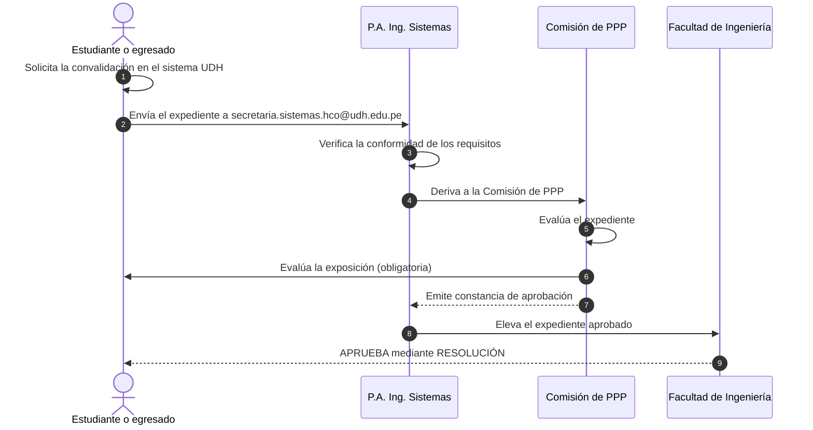

# Proceso de Prácticas Pre Profesionales (PPP) — Plan 2021

> Programa Académico de Ingeniería de Sistemas e Informática — Facultad de Ingeniería, UDH
> Documento de referencia para el equipo del proyecto de Servicio Social.
>
> **Fuentes:**
> - Reglamento de PPP del P.A. de Ing. de Sistemas e Informática — 2021 (Modalidad Presencial)
>   · Res. N° 221-2021-CF-FI-UDH · ratificado por Res. N° 029-2022-R-CU-UDH (01/02/2022)
> - Flujograma operativo entregado por Coordinación
>
> **Regla de precedencia aplicada:** el reglamento define los plazos y condiciones de fondo;
> el flujograma define la operativa vigente (secuencia de trámites, correos, formatos).
> Donde hubo discrepancia, se optó por lo indicado por Coordinación y queda anotado en la sección 11.

---

## 1. Actores

| Código | Actor | Rol |
|---|---|---|
| `EST` | Estudiante | Inicia todos los trámites |
| `EMP` | Entidad receptora (empresa/institución) | Acepta al practicante, evalúa y certifica |
| `PA` | P.A. de Ingeniería de Sistemas | Recepciona, verifica y deriva |
| `COM` | Comisión de PPP | Revisa, aprueba, designa supervisor, evalúa y sustenta |
| `FAC` | Facultad de Ingeniería (Decanato) | Emite carta de presentación y resolución final |
| `SUP` | Asesor–Supervisor (docente) | Acompaña la ejecución y evalúa |

## 2. Condiciones para iniciar la PPP

| Condición | Detalle | Base |
|---|---|---|
| Ciclo | Haber concluido satisfactoriamente todos los cursos de especialidad **hasta el octavo ciclo** | Art. 15 |
| Duración | **600 horas** efectivas | Art. 15 |
| Horario | No debe superponerse con el horario de clases | Art. 15 |
| Obligatoriedad | Requisito indispensable para el Grado de Bachiller. Sin exoneración | Arts. 1 y 3 |
| Dónde | Empresa o institución pública o privada del rubro, que cuente con un Ing. de Sistemas o carrera afín para supervisar | Arts. 4 y 6 |
| Áreas válidas | Desarrollo de sistemas · Infraestructura, redes y comunicaciones · Seguridad y auditoría · Gestión de TIC · Gestión de proyectos | Art. 14 |

## 3. Correos y pagos

| Etapa | Correo destino | Pago |
|---|---|---|
| Carta de presentación | `secretaria.fac.ing@udh.edu.pe` | S/ 5.00 |
| Plan de PPP | `comision.practicas.isi@udh.edu.pe` | — |
| Informe final de PPP | `secretaria.sistemas.hco@udh.edu.pe` | — |

⚠️ **El correo cambia en cada etapa.** Es el error más común y el chatbot debe resolverlo con precisión.

## 4. Plazos

| Hito | Plazo | Base |
|---|---|---|
| Presentar el Plan de PPP | **15 días calendarios** luego de iniciada la práctica | Art. 18 |
| Subsanar observaciones del Plan | **7 días hábiles** desde la entrega de observaciones | Art. 22 |
| Presentar el Informe final | **20 días hábiles** después de concluida la práctica | Art. 28 |
| Subsanar observaciones tras la sustentación | **10 días hábiles** · su incumplimiento anula la práctica | Art. 30 |
| Reinicio tras anulación | **30 días calendarios**, en otra empresa o institución | Arts. 21 y 22 |

## 5. Anexos del reglamento

| Anexo | Documento | Etapa |
|---|---|---|
| Anexo 02 | Carta de compromiso | Carta de presentación |
| Anexo 03 | Carta de aceptación de la entidad receptora | Carta de presentación |
| Anexo 04 | Esquema del Plan de Trabajo | Plan de PPP |
| Anexo 05 | Estructura del Informe Final | Informe final |
| Anexo 06 | Ficha de evaluación (jefe de área) | Informe final |
| Anexo 07 | Ficha de supervisión (asesor–supervisor) | Informe final |
| Anexo 10 | Ficha de avances | Durante la ejecución |

> Los Anexos 08 y 09 pertenecen al proceso de **convalidación** de PPP (ver sección 10).

---

## 6. Vista general del proceso

---

## 7. Etapa 1 — Carta de presentación

**Salida:** carta de presentación firmada por el Decanato, en el correo institucional del estudiante.

---

## 8. Etapa 2 — Plan de PPP

**Salida:** Plan de PPP aprobado por la Comisión y Asesor–Supervisor designado. No requiere resolución de Facultad.

---

## 9. Etapa 3 — Ejecución de la práctica

### Causales de anulación o desaprobación (Art. 40)

- Incumplir lo establecido en el reglamento
- Presentar documento falsificado o adulterado
- Presentar un informe plagiado
- Faltar sin justificación 3 días consecutivos o 5 alternados
- No encontrarse en el centro de prácticas durante la supervisión
- Informe de desaprobación del tutor de la empresa o del asesor–supervisor

---

## 10. Etapa 4 — Informe final y sustentación

### Expediente del informe final (todo en PDF)

- [ ] Constancia de PPP de la empresa (fecha de inicio, finalización y labores realizadas)
- [ ] Ficha de evaluación emitida por el jefe de área (ANEXO 06)
- [ ] Informe de PPP según la estructura del ANEXO 05
- [ ] Ficha de supervisión y evaluación firmada y sellada por el Asesor–Supervisor (ANEXO 07)
- [ ] Formato de asistencia firmado y sellado por el representante de la institución o jefe de área
- [ ] Constancia de inscripción al sistema del área de Seguimiento del Graduado

**Condiciones de aprobación (Art. 26):** informe del Asesor–Supervisor + evaluación de la Comisión + constancia de sustentación.

**Salida del proceso:** Resolución de aprobación de PPP emitida por la Facultad de Ingeniería.

---

## 11. Convalidación de PPP por experiencia laboral

Vía excepcional para quien acredite haber laborado en labores vinculadas a la especialidad (Art. 31).

| Condición | Detalle |
|---|---|
| Ciclo | Mínimo **sexto ciclo concluido** |
| Tiempo | No menor a **16 meses** (dos años académicos) |
| Vínculo | Nombrado o contratado en institución pública o privada |
| Exposición | **Obligatoria**, coordinada con el jefe de prácticas |

### Expediente de convalidación (Art. 32)

- [ ] Solicitud al Coordinador del P.A. pidiendo la convalidación (ANEXO 08)
- [ ] Constancia(s) de trabajo y/o contrato(s) original, con tipo de trabajo, fecha de ingreso y duración
- [ ] Boletas de pago de haberes por cada institución donde laboró
- [ ] Ficha de evaluación del jefe, director o representante (con cargo y firma)
- [ ] Informe técnico según el esquema del ANEXO 09
- [ ] Recibo de pago por derecho de trámite documentario

---

## 12. Criterios adoptados donde el reglamento y el flujograma discrepan

Registrados para trazabilidad. Decisión tomada con Coordinación.

| Punto | Reglamento | Flujograma | Criterio adoptado |
|---|---|---|---|
| Orden de la carta de aceptación | Art. 7: la aceptación se emite **después** de recibir la carta de presentación | La aceptación es requisito **previo** para pedir la carta de presentación | **Flujograma** |
| Plazo del informe final | Art. 28: 20 días hábiles · Art. 38: 20 días calendarios | 20 días | **20 días hábiles** |
| Formato del informe | Art. 28: físico anillado + digital PDF y DOCX | Solo PDF por correo | **Flujograma: solo PDF** |
| Correos de destino | Solo menciona "correo institucional del P.A. / de la Comisión" | Tres correos específicos por etapa | **Flujograma** |
| Solicitud de practicante (Anexo 01) | Art. 7: la empresa la presenta antes de todo | No aparece | **Omitido** |
| Documento de autorización de la Comisión | Art. 7 inc. 2 | No aparece | **Omitido** |

> Nota: el Art. 29 remite al "Art. 24°" cuando por contenido corresponde al Art. 28. Es un error de referencia cruzada del reglamento.

---

*Última actualización: 29/09/2026 · Elaborado para el equipo del proyecto de Servicio Social*
