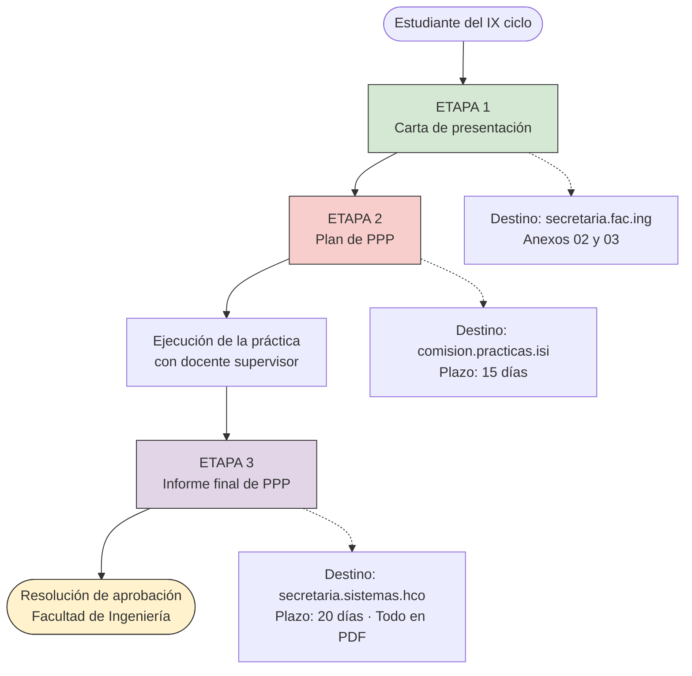
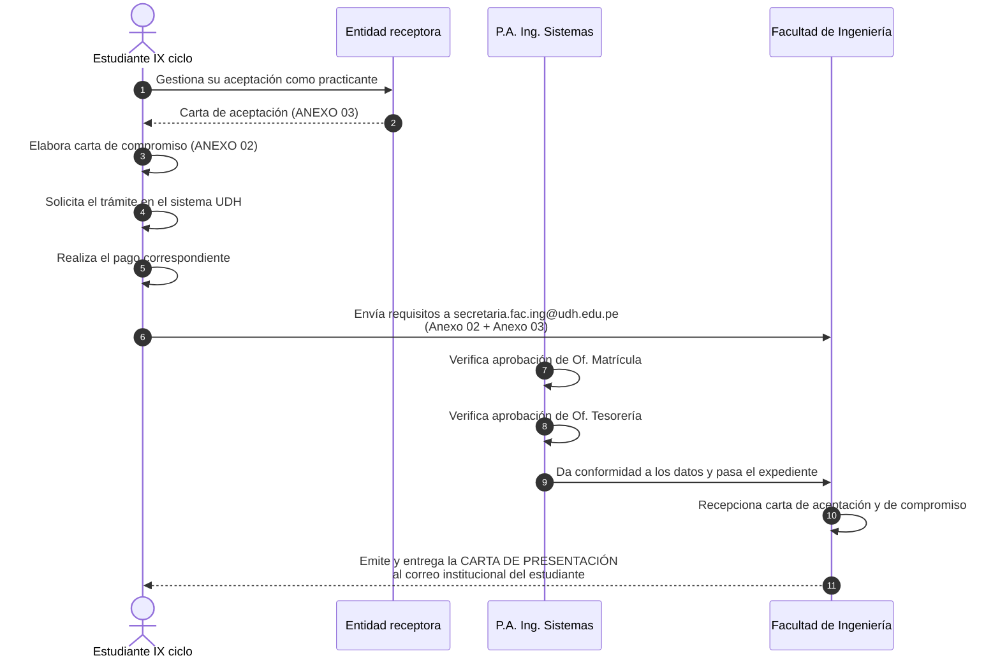
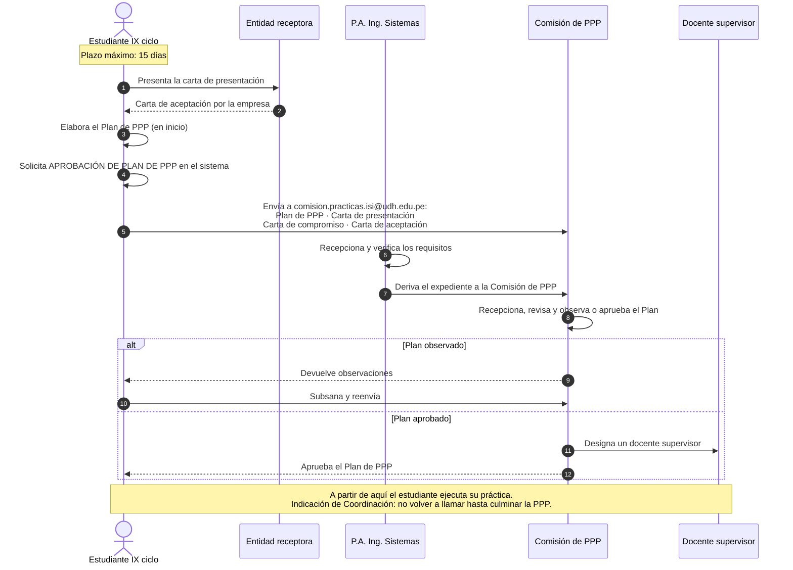
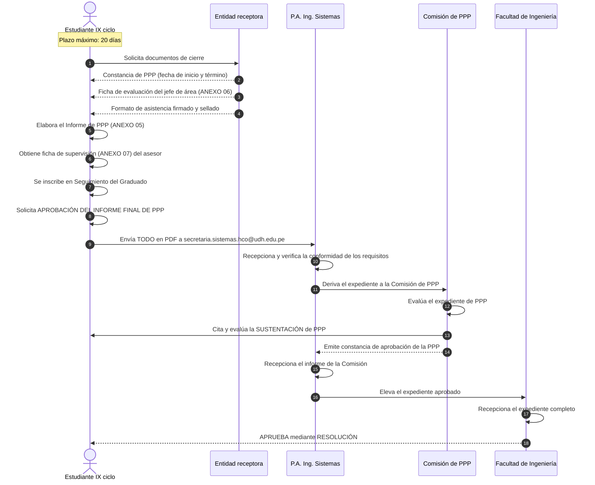

# Proceso de Prácticas Pre Profesionales (PPP) — Plan 2021

> Programa Académico de Ingeniería de Sistemas e Informática — Facultad de Ingeniería, UDH
> Documento de referencia para el equipo del proyecto de Servicio Social.
> Fuente: flujograma oficial entregado por Coordinación.

---

## 1. Actores

| Código | Actor | Rol |
|---|---|---|
| `EST` | Estudiante del IX ciclo | Inicia todos los trámites |
| `EMP` | Entidad receptora (empresa/institución) | Acepta al practicante, evalúa y certifica |
| `PA` | P.A. de Ingeniería de Sistemas | Recepciona, verifica y deriva |
| `COM` | Comisión de PPP | Revisa, aprueba, designa supervisor, evalúa |
| `FAC` | Facultad de Ingeniería | Emite carta de presentación y resolución final |
| `SUP` | Docente supervisor | Acompaña la ejecución de la práctica |

## 2. Correos de contacto

| Etapa | Correo destino |
|---|---|
| Carta de presentación | `secretaria.fac.ing@udh.edu.pe` |
| Plan de PPP | `comision.practicas.isi@udh.edu.pe` |
| Informe final de PPP | `secretaria.sistemas.hco@udh.edu.pe` |

⚠️ **El correo cambia en cada etapa.** Es el error más común y el chatbot debe resolverlo con precisión.

## 3. Plazos

| Hito | Plazo |
|---|---|
| Presentar el Plan de PPP | 15 días como máximo |
| Presentar el Informe de PPP | 20 días como máximo |

## 4. Anexos requeridos

| Anexo | Documento | Etapa |
|---|---|---|
| Anexo 02 | Carta de compromiso | Carta de presentación |
| Anexo 03 | Carta de aceptación de la entidad receptora | Carta de presentación |
| Anexo 05 | Estructura del Informe de PPP | Informe final |
| Anexo 06 | Ficha de evaluación del jefe de área | Informe final |
| Anexo 07 | Ficha de supervisión y evaluación (asesor/supervisor) | Informe final |

---

## 5. Vista general del proceso

---

## 6. Etapa 1 — Carta de presentación

**Salida de la etapa:** carta de presentación en el correo institucional del estudiante.

---

## 7. Etapa 2 — Plan de PPP

**Salida de la etapa:** Plan de PPP aprobado y docente supervisor designado.

---

## 8. Etapa 3 — Informe final de PPP

### Expediente del informe final (todo en PDF)

- [ ] Constancia de PPP de la empresa o institución (con fecha de inicio y término)
- [ ] Ficha de evaluación emitida por el jefe de área (ANEXO 06)
- [ ] Informe de PPP según estructura establecida (ANEXO 05)
- [ ] Ficha de supervisión y evaluación firmada por el asesor/supervisor (ANEXO 07)
- [ ] Formato de asistencia firmado y sellado por el jefe de la empresa
- [ ] Constancia de inscripción al sistema del área de Seguimiento del Graduado

**Salida del proceso:** Resolución de aprobación de PPP emitida por la Facultad de Ingeniería.

---

## 9. Dudas pendientes de confirmar con Coordinación

Estas preguntas deben resolverse antes de cargar el proceso a la base de conocimiento del chatbot.

| # | Duda | Por qué importa |
|---|---|---|
| 1 | En la Etapa 1 el estudiante envía a `secretaria.fac.ing`, pero quien verifica primero es el P.A. ¿El estudiante debe copiar también al P.A. o el flujo interno lo resuelve? | El chatbot dará un correo incorrecto si esto no está claro |
| 2 | ¿Cuánto cuesta el trámite de carta de presentación? El flujograma dice "realiza el pago" pero no indica monto | Es de las preguntas más frecuentes |
| 3 | ¿El Plan de PPP se aprueba solo por la Comisión o también requiere resolución de Facultad? | Define si hay una cuarta etapa |
| 4 | Los plazos de 15 y 20 días, ¿son hábiles o calendario? ¿Desde qué hito se cuentan? | Cálculo de fechas en el chatbot |
| 5 | ¿Cuántas horas o meses mínimos dura la PPP en el Plan 2021? | No aparece en el flujograma |
| 6 | ¿Existe un plazo máximo para subsanar observaciones al Plan de PPP? | Estudiantes preguntan por esto |
| 7 | ¿Dónde se descargan los Anexos 02, 03, 05, 06 y 07? ¿Hay enlace público? | El chatbot debería entregar el enlace directo |
| 8 | La sustentación de PPP, ¿es presencial o virtual? ¿Quién la programa y cómo se avisa? | Dato no documentado |
| 9 | ¿Hay requisitos previos de matrícula o ciclo además de estar en IX ciclo? | Filtro de elegibilidad |
| 10 | ¿Este flujo aplica solo al Plan 2021 o también a planes anteriores? | Determina el versionado del contenido |

---

*Última actualización: 28/09/2026 · Elaborado para el equipo del proyecto de Servicio Social*
